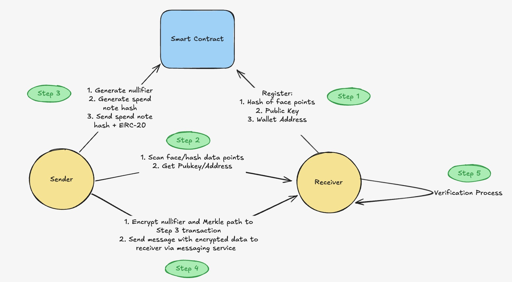
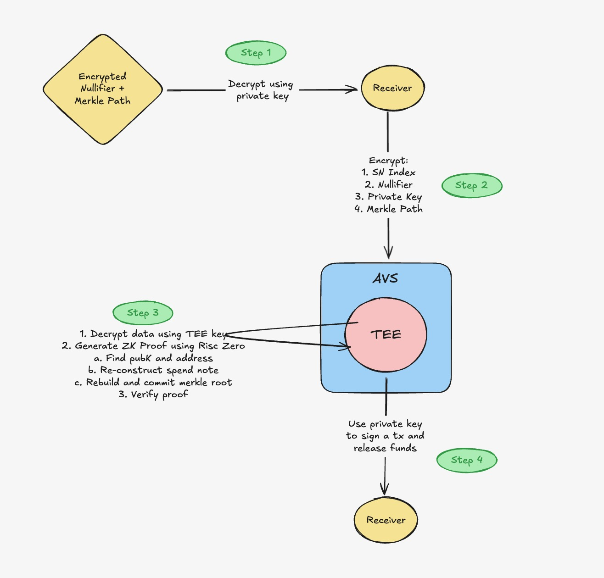

# IntelliFi - Face the Future

A privacy-preserving, secure system for face-based cryptocurrency transactions using zero-knowledge proofs, trusted execution environments, and EigenLayer AVS.

## Architecture Overview

This project implements a secure face-based transaction system with the following components:

1. **Frontend Client**: React application for user registration and transaction initiation
2. **Backend Server**: Node.js server handling face recognition, messaging, and transaction coordination
3. **Bounless (RISC0) ZK Prover**: Zero-knowledge proof generation for private transaction validation
4. **Tangle AVS**: EigenLayer AVS implementation for secure key management and transaction verification
5. **Smart Contract**: Solidity contract deployed on Base Sepolia for registration and transaction processing

### Architecture Diagrams

#### Transaction Flow


#### Registration and Verification Flow


## Demo Video
Check out our demo video to see IntelliFi in action:
[Watch the Demo](https://drive.google.com/file/d/1C7VOJ1xoCZyyvwRti3hkTymfdjQtr41r/view?usp=sharing)


## User Flow

1. **Registration**:
   - User scans face to generate face embeddings
   - Face data is stored on IPFS
   - User signs a transaction with wallet address, public key, and face hash
   - Data is registered on the smart contract

2. **Transaction**:
   - Sender takes a picture using smart glasses
   - System performs similarity scoring against IPFS hash
   - If match is found, system returns the public key
   - Backend generates a secure nullifier
   - System creates a spend note hash(address + nullifier)
   - Transaction is added to a Merkle tree
   - Receiver is sent a link with encrypted nullifier and merkle path (encrypted with receiver's public key)
   - Receiver decrypts nullifier and merkle path using their private key
   - Receiver encrypts private data(specified in architecture diagram) and sends it to an AVS
   - ZK proof is generated through Boundles (RISC0) within a TEE managed by the EigenLayer AVS to verify transaction validity
   - TEE uses receiver's private key to releases funds to the recipient if valid

## Setup and Installation

### Prerequisites

- Node.js (v18+)
- Rust (for RISC0 and Tangle AVS)
- Docker (optional, for containerized deployment)
- Metamask or other Web3 wallet
- Pinata API key (for IPFS storage)


### Frontend Setup

```bash
# Clone the repository
git clone https://github.com/narasim-teja/IntelliFi.git
cd IntelliFi/frontend

# Install dependencies
npm install
# or
pnpm install

# Create .env file from example
cp .env.example .env.local


# Start development server
npm run dev
# or
pnpm dev
```

### Backend Setup

```bash
# Navigate to backend directory
cd backend

# Install dependencies
npm install
# or
bun install

# Create .env file from example
cp .env.example .env

# Start server
npm run start
# or
bun run server.ts
```

### RISC0 ZK Prover Setup

```bash
# Navigate to RISC0 directory
cd backend/risc0/privacy-zkp

# Build the project
cargo build --release

# Run tests
cargo test


```

### Tangle AVS Setup

```bash
# Navigate to Tangle AVS directory
cd backend/tangle-avs

# Install dependencies
cargo build --release

```

## Component Details

### Frontend Client

The frontend is a React application that provides:
- User registration interface
- Face scanning functionality
- Transaction initiation
- Wallet connection

Key features:
- Built with React, TypeScript, and Vite
- Uses TailwindCSS for styling
- Integrates with Web3 wallets via ethers.js
- Communicates with backend for face processing

### Backend Server

The backend server handles:
- Face recognition and similarity scoring
- Messaging service for transaction coordination
- Nullifier generation
- Spend note creation
- Merkle tree management

Key features:
- Built with Node.js/TypeScript or Bun
- Uses TensorFlow.js for face embedding generation
- Integrates with IPFS via Pinata for storing face embeddings
- Implements secure nullifier generation with encryption
- Manages Merkle tree for transaction verification

The server exposes several endpoints:
- `/process-face`: Processes face images and generates embeddings
- `/verify-face`: Verifies a face against stored embeddings
- `/generate-nullifier`: Creates a secure nullifier for transactions
- `/test-nullifier`: Tests nullifier verification

### RISC0 ZK Prover

The RISC0 implementation provides:
- Zero-knowledge proofs for transaction validation
- Off-chain computation without data leakage
- Verification of Merkle paths without revealing the path

Key features:
- Uses RISC Zero zkVM for zero-knowledge proof generation
- Implements circuits for nullifier verification
- Verifies Merkle paths without revealing sensitive data
- Can run locally

### Tangle AVS

The EigenLayer AVS implementation provides:
- Trusted Execution Environment (TEE) for secure key management
- Decryption of sensitive data
- ZK proof verification
- Merkle tree commitment

Key features:
- Implements EigenLayer AVS specification
- Runs in a TEE environment for secure processing
- Decrypts sensitive data securely
- Verifies zero-knowledge proofs
- Manages transaction commitments

### Smart Contract

The smart contract (FaceRegistar.sol) deployed on Base Sepolia handles:
- User registration with face hash, public key, and wallet address
- Spend note creation and tracking
- Merkle root storage
- Transaction verification and fund release

Key functions:
- `register(bytes32 _faceHash, string calldata _ipfsHash, bytes calldata _publicKey)`: Registers a user's face data
- `createSpendNote(bytes32 _noteHash)`: Creates a new spend note with 0.1 ETH
- `updateMerkleRoot(bytes32 _newRoot)`: Updates the Merkle root
- `spendNote(bytes32 _noteHash, bytes32 _nullifier, address payable _recipient, bytes32[] calldata _merkleProof)`: Spends a note and transfers funds

## Security Features

- **Face Recognition**: Secure biometric verification
- **Nullifier Generation**: Prevents double-spending using cryptographically secure random numbers
- **Zero-Knowledge Proofs**: Privacy-preserving transaction validation
- **Merkle Trees**: Efficient and secure transaction tracking
- **Trusted Execution Environment**: Secure key management
- **EigenLayer AVS**: Decentralized validation and security

